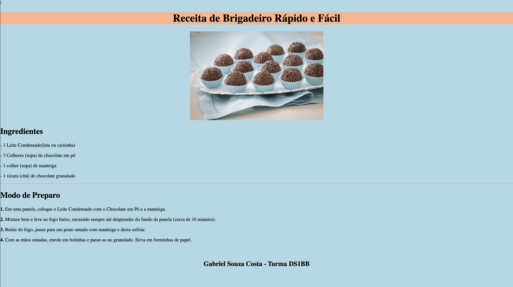

# Receita de Brigadeiro

---

## Sobre
Site sobre receita de brigadeiro, e serve pra divulgar e colocar em prática os conhecimentos adiquiridos sobre linguagem de marcação, durante o curso de desenvolvimento de sistemaqs do [SENAI Jandira](https://sp.senai.br/unidade/jandira/)

---

## Tecnologias utilizadas
- HTML
- CSS
- Markdown
- Git

---

## Autor
- [Gabriel Souza Costa](https://github.com/gabs0050)
